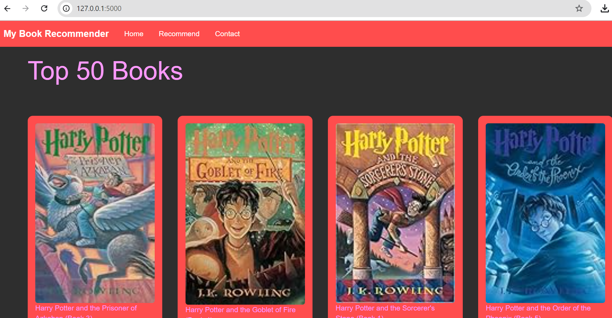
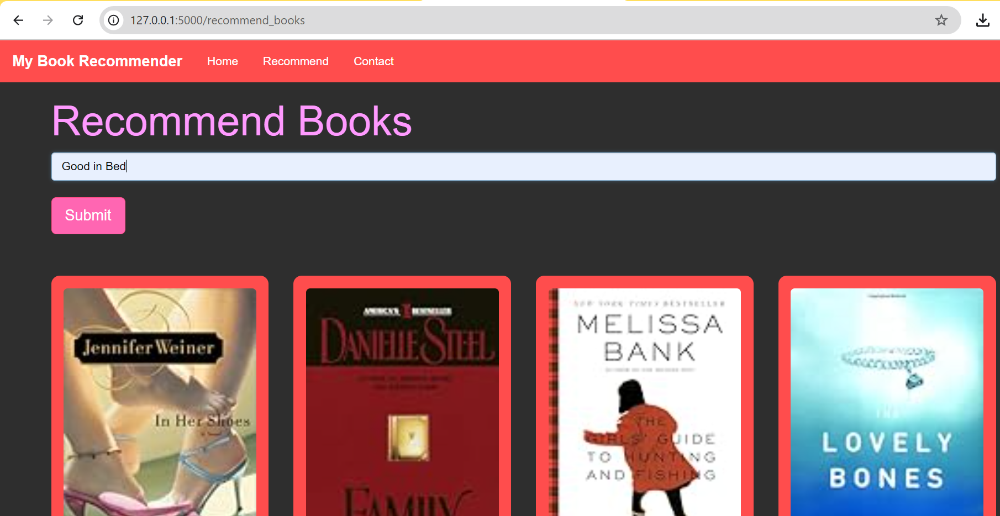

# Book Recommender System

Welcome to the **Book Recommender System**! This web application recommends books based on user preferences and interests. Whether you're looking for something new to read or want to discover hidden gems, this system helps you find your next favorite book!

## Features

- **Top 50 Books**: Displays a curated list of popular books with covers and titles.
- **Personalized Recommendations**: Input a book title, and the system will suggest similar books based on your preferences.
- **User-Friendly Interface**: The application boasts a clean, responsive design with Bootstrap styling and a vibrant color scheme.
- **Interactive Book Cards**: Each recommended book is displayed in a visually appealing card format with cover images and titles.
- **Backend Integration**: Utilizes Flask to manage user input and process recommendations seamlessly.

## Tech Stack

- **Frontend**: HTML, CSS (with Bootstrap)
- **Backend**: Python with Flask framework
- **Data Processing**: Pandas and Numpy for data manipulation
- **Recommendation Algorithm**: Collaborative filtering and other techniques
- **Deployment**: Runs locally; can be easily deployed to a web server

## Getting Started

Follow these steps to set up the Book Recommender System on your local machine:

### Prerequisites

- Python 3.x
- pip (Python package installer)

### Installation

1. Clone the repository:

   ```bash
   git clone https://github.com/your-username/book-recommender.git
   ```

2. Navigate to the project directory:

   ```bash
   cd book-recommender
   ```

3. Install the required packages:

   ```bash
   pip install -r requirements.txt
   ```

### Running the Application

1. Start the Flask app:

   ```bash
   python app.py
   ```

2. Open your browser and go to `http://127.0.0.1:5000`.

3. Enjoy exploring the top 50 books and get personalized recommendations!

## Screenshots

### Home Page


### Recommendation Page


